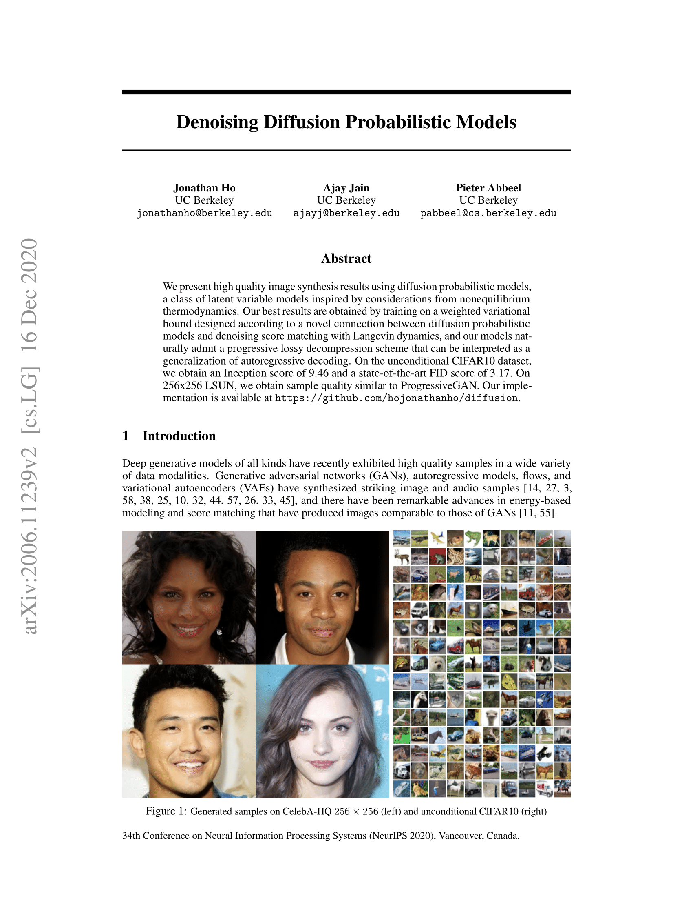
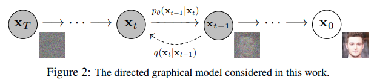

# 原文

《The Annotated Diffusion Model》
https://huggingface.co/blog/annotated-diffusion


# 译文

在这篇博客文章中，我们将深入探讨**去噪扩散概率模型**（也被称为DDPMs、扩散模型、基于评分的生成模型或者简单地称为[自编码器](https://benanne.github.io/2022/01/31/diffusion.html)）。研究人员已经能够用它们取得显著的结果，用于（有条件或无条件的）图像/音频/视频生成。（在本文写作时）流行例子包括OpenAI的[GLIDE](https://arxiv.org/abs/2112.10741)和[DALL-E 2](https://openai.com/dall-e-2/)，海德堡大学的[Latent Diffusion](https://github.com/CompVis/latent-diffusion)，以及Google Brain的[ImageGen](https://imagen.research.google/)。

我们将逐步实现原始DDPM论文（[Ho等人，2020](https://arxiv.org/abs/2006.11239)）中的内容，这是基于Phil Wang的[实现](https://github.com/lucidrains/denoising-diffusion-pytorch) - 它本身是基于[原始TensorFlow实现](https://github.com/hojonathanho/diffusion)。请注意，扩散用于生成建模的想法实际上早在（[Sohl-Dickstein等人，2015](https://arxiv.org/abs/1503.03585)）就已经被引入。然而，直到（[Song等人，2019](https://arxiv.org/abs/1907.05600)）（在斯坦福大学），然后是（[Ho等人，2020](https://arxiv.org/abs/2006.11239)）（在Google Brain）独立改进了这种方法。

请注意，对扩散模型（的实现）有[几种不同的方法](https://twitter.com/sedielem/status/1530894256168222722?s=20&t=mfv4afx1GcNQU5fZklpACw)。在这里，我们采用离散时间（潜变量模型）的方法，但同时务必要去了解其他的方法。

好的，让我们开始吧！

```
from IPython.display import Image
Image(filename='assets/78_annotated-diffusion/ddpm_paper.png')
```


我们将首先安装并导入所需的库（假设您安装了 [PyTorch](https://pytorch.org/)）。

```
!pip install -q -U einops datasets matplotlib tqdm

import math
from inspect import isfunction
from functools import partial

%matplotlib inline
import matplotlib.pyplot as plt
from tqdm.auto import tqdm
from einops import rearrange, reduce
from einops.layers.torch import Rearrange

import torch
from torch import nn, einsum
import torch.nn.functional as F
```

## 什么是扩散模型

如果你将其与其他生成模型（如规范化流、GANs或VAEs）进行比较，（去噪）扩散模型并不复杂：它们都将来自某个简单分布的噪声转换为数据样本。在这里也是如此，神经网络**学习逐渐从纯噪声开始去噪**最终得到输出的结果。

对于图像来说，更详细的步骤（set-up）包括两个过程：

+ 一个我们选择的固定（或预定义）的前向扩散过程q，它会逐步向图像添加高斯噪声，直到你得到纯噪声。

+ 一个经过学习的的反向去噪扩散过程p<sub>θ</sub>，它是一个训练好的神经网络，从纯噪声开始逐渐对图像进行去噪，直到最终得到实际图像。



前向和反向过程发生在一定数量的有限时间步骤内T（DDPM作者使用T = 1000）中，由t索引。你由t = 0开始，从你的数据分布（比如说从ImageNet中的一只猫的图像）中采样一个真实的图像X<sub>0</sub>，并且前向过程时在每个时间步骤t中从高斯分布中采样一些噪声，这些噪声被添加到前一个时间步骤的图像中。给定一个足够大的T和一个在每个时间步骤内添加噪声的好的调度器（well behaved schedule），你最终会通过一个渐进过程在t=T时得到所谓的各向同性高斯分布（[isotropic Gaussian distribution](https://math.stackexchange.com/questions/1991961/gaussian-distribution-is-isotropic)）。
​
 
## 以更加数学的形式说明

让我们更正式地将过程写下来，因为最终我们需要一个易于处理的损失函数，我们的神经网络需要对其进行优化。

假设q(X<sub>0</sub>)是真实的数据分布，比如说“真实图像”。 我们可以从这个分布中采样以获得图像，X<sub>0</sub> ~ q(X<sub>0</sub>)。我们定义前向扩散过程q(x<sub>t</sub> ∣ x <sub>t−1</sub>)，它在每个时间步骤中添加高斯噪声
