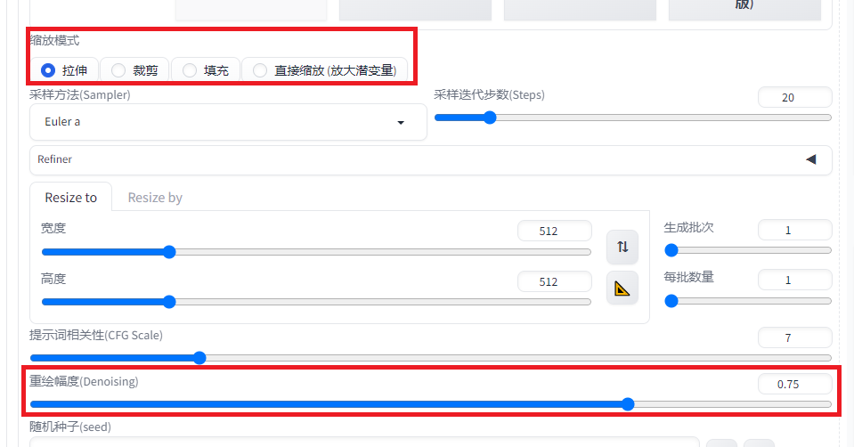
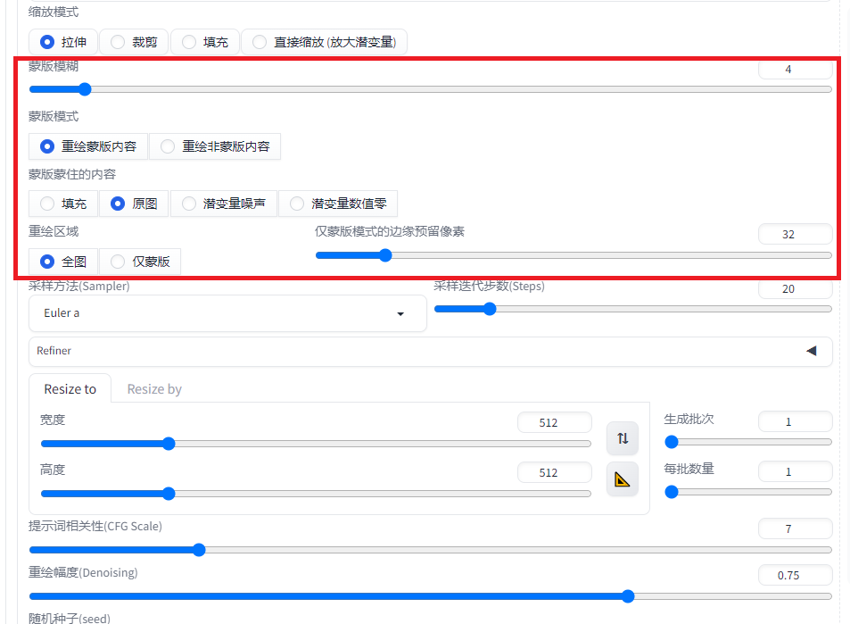
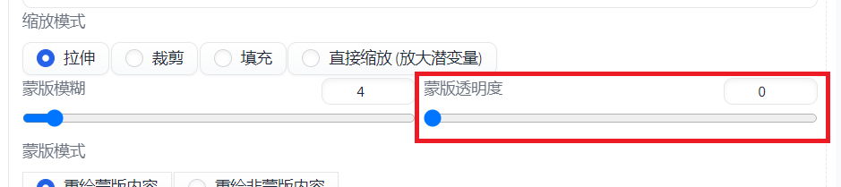

# 前言

本文为图生图功能信息的汇总，相当于Cheat Sheet和备忘录。

# 概述

图生图页面有多个选项卡，按大功能可以分为三个大类：

* 图生图，包括 **图生图**、**绘图** 选项卡
* 局部重绘，包括 **局部重绘**、**局部重绘（手涂蒙板）**、**局部重绘（上传蒙板）** 选项卡
* 批量处理，包括 **批量处理** 选项卡

-----------------------------------------------------------------------------

## 图生图

图生图两个选项卡之间的差别就在于是否能在网页上对图片进行涂鸦，其它功能是一样的。

这个功能相当于在文生图的基础上，输入一个图片作为初始图像，而非从随机噪声开始生成。提示词和文生图同理。

相对“文生图”来说，“图生图”多了两个参数：“缩放模式”和“重绘幅度”

### 缩放模式

这个参数用来解决原图与生成图片宽高不一致的问题。为避免问题，建议生成图片的大小或比例与原图一致（就样就用不到下面的操作了）。

* 拉伸

> 直接将原图拉伸到生成图片的分辨率，比例不对会变形

* 裁剪

> 根据生成图片的纵横比裁剪原图，再进行接下来的处理

* 填充

> 保持图片比例进行缩放，再用图像颜色填充空白区域

* 直接缩放（放大潜变量）

> 先拉伸，再用噪声填充，变化最大。
> 图片可能会出现不合理的地方，这个时候可以增加采样次数提升图片质量。

### 重绘幅度

即“降噪强度”。数值越小越接近原图，反之则差异越大。降噪强度为0图像保持不变，降噪强度为1会完全改变图像。一般设置在0.5 ~ 0.75左右。

### 其它Tips

> 上传图片后可以调整绘制的区域。

> “将图片复制到”功能不稳定，不建议使用。

-----------------------------------------------------------------------------

## 局部重绘

重绘图片指定区域，主要用来修复图片局部的瑕疵。主要有以下几个步骤：

1. 确定蒙版区域 - 确定重绘的像素
2. 蒙版区域预处理 - 为蒙版区域填充颜色，填充的颜色对结果有直接影响，所以尽可能地填充和期望结果相近的颜色
3. 蒙版模糊 - 将填充的颜色柔和化，产生过渡效果
4. 生成图片 - 和文生图与图生图一样

上传图片后，用界面上的画笔涂抹需要重绘的区域，即为蒙版区域。对应 **步骤1** 。

和图生图相比，多了5个参数：

#### 蒙版模糊

> 对应 **步骤3** 。数值越小，模糊程度越高。默认值4一般就行。

#### 蒙版模式

> 选择重绘蒙版的的区域还是除蒙版外的区域。

#### 蒙版蒙住的内容

> 蒙版区域的预处理方式，对应 **步骤2** 。
> 
> + 填充：将原图像蒙版部分直接模糊。模糊程度可以通过上面的“蒙版模糊”参数调整。
> + 原图：不进行预处理，直接使用原始图像进行重绘。不受“蒙版模糊”参数影响。
> + 潜变量噪声：用噪声进行填充，结果会与原图存大很大差异。
> + 潜变量数值0：用潜变量0值进行填充，从效果上看就是填充棕色。
> 
> 前两个对原图改动较小，后两个则改动较大。

#### 重绘区域

> + 全图：修复完成后将整张图片的宽高进行调整，受上面的缩放模式影响。由于处理整张图，所以重绘大图会占用更多显存。
> 
> + 仅蒙版：只对蒙版区域进行绘制，可以处理高分辨率图片。需要设置“仅蒙版模式的边缘预留像素”，此外分辨率设置也会影响填充像素的密度。

#### 仅蒙版模式的边缘预留像素

> 参考附近的像素值，类似羽化效果。数值低，重绘部分和原图的融合度越低；数值越高，和原图的融合度越高
> 
> 在"潜变量噪声"模式下，数值越小，则像素密度越大；数值越大，则像素密度越小。
> 
> 填充的像素密度越高，所生成的内容就越丰富。但并不是密度越高越好，主要还是看蒙版的区域大小。当蒙版区域过小时，会图中图的问题，而如果蒙版区域较大，高密度的填充会使内容更加完善。
> 
> 而而言之，如果重绘区域小，则采用较高的值；反之，采用较低的值。

讲完了五个参数，下面是“局部重绘（手涂蒙板）”和“局部重绘（上传蒙板）”中不同的地方。

#### 局部重绘（手涂蒙板）

这个功能比“局部重绘”选项卡多了一个参数：“蒙版透明度”：

该功能的手绘并非仅用来指定蒙版区域，而是同时 **指定了填充的颜色** 。相当于手工做 **步骤2** ，填充的颜色会影响最终结果。

可以通过调整“蒙版透明度”参数来调整填充颜色的透明度（数值越小透明度越低）。

#### 局部重绘（上传蒙板）

上传一个图片作为蒙版，蒙版图片为黑白两色，其中 **白色代表蒙版区域** 。

这个功能的好处在于，可以用PS来精确选择修复区域，

#### 关于提示词

可以使用生成图片时相同的提示词。如果没有原始提示词数据，可以使用“CLIP反推提示词”功能。

#### TIPS

如果觉得重绘区域与全图不协调，建议可以加大“采样迭代步数”。

如果重绘出现多余图像，可以减少“采样迭代步数”。

-----------------------------------------------------------------------------

# 参考资料

https://civitai.com/articles/161/basic-inpainting-guide

https://github.com/AUTOMATIC1111/stable-diffusion-webui/wiki/Features#inpainting

https://www.bilibili.com/video/BV1Fg4y1s7df/?vd_source=15382cb163db3fd3ce2d2dd6b97e422a
